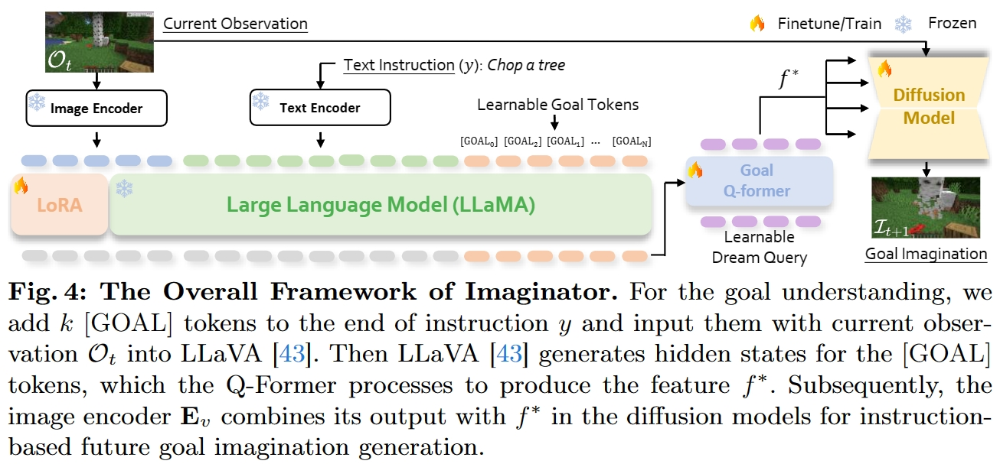
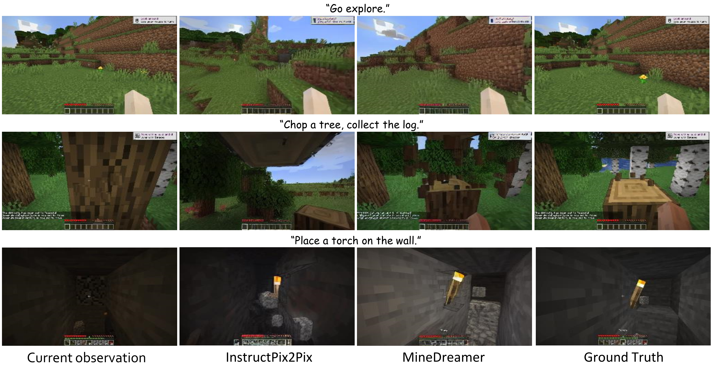
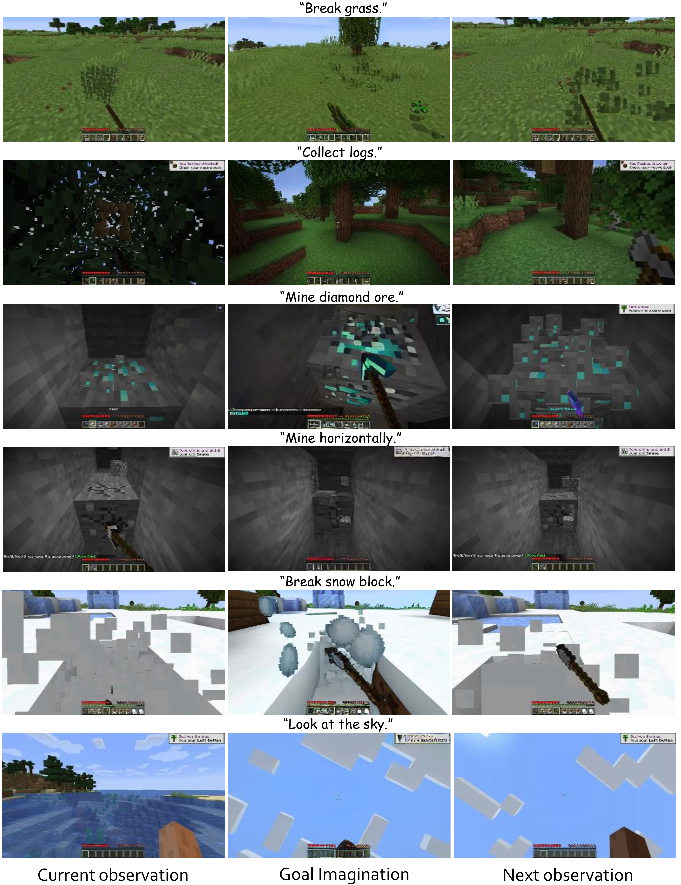

<div align="center">
<h1><i>MineDreamer</i> : Learning to Follow Instructions via </center> <br> <center>Chain-of-Imagination for Simulated-World Control </h1>

📢 We are organizing the code for *MineDreamer* now. If you are interested in our work, please star ⭐ our project.

🚧 [Project Page](https://sites.google.com/view/minedreamer/main) |  📖 [Arxiv](https://arxiv.org/abs/2403.12037) | 🗒️ [PDF](https://arxiv.org/pdf/2403.12037.pdf) 


[](https://pytorch.org/)

[](https://www.apache.org/licenses/LICENSE-2.0)
</div>


## 🔥 Updates
[2024-03-19] *MineDreamer* is released on [arxiv](https://arxiv.org/abs/2403.12037).

[2024-03-15] The Project page is set up at [here](https://sites.google.com/view/minedreamer).


## 😋 Try *MineDreamer*
The code and checkpoints will be released  and the release plan is roughly as follows:

- [ ] *MineDreamer*(wo Imaginator) Code;  Baseline Code(i.e., VPT, STEVE-1, Multi-Modal Memory)
- [ ] Imaginator Code; Imaginator CheckPoints
- [ ] Dataset & Training Scripts; Let's enjoy creating your dataset and training your own model


## 🕶️Overview

### The Overview of Chain-of-Imagination within *MineDreamer*
<div align="center"> 
    
</div>


### The Overview Framework of Imaginator within *MineDreamer*
<div align="center"> 
    
</div>


## 📹 Demo video and Imagination Visual Results
More demo videos and Imagination visual results are on our [project webpage](https://sites.google.com/view/minedreamer).

### Imagination Visual Results on Evaluation Set Compared to the Baseline
<div align="center"> 
    
</div>

### Imagination Visual Results During Agent Solving Open-ended Tasks
<div align="center"> 
    
    
</div>


## 📑 Citation

If you find *MineDreamer* useful for your research and applications, please cite using this BibTeX:
```
@misc{zhou2024minedreamer,
      title={MineDreamer: Learning to Follow Instructions via Chain-of-Imagination for Simulated-World Control}, 
      author={Enshen Zhou and Yiran Qin and Zhenfei Yin and Yuzhou Huang and Ruimao Zhang and Lu Sheng and Yu Qiao and Jing Shao},
      year={2024},
      eprint={2403.12037},
      archivePrefix={arXiv},
      primaryClass={cs.CV}
}
```
